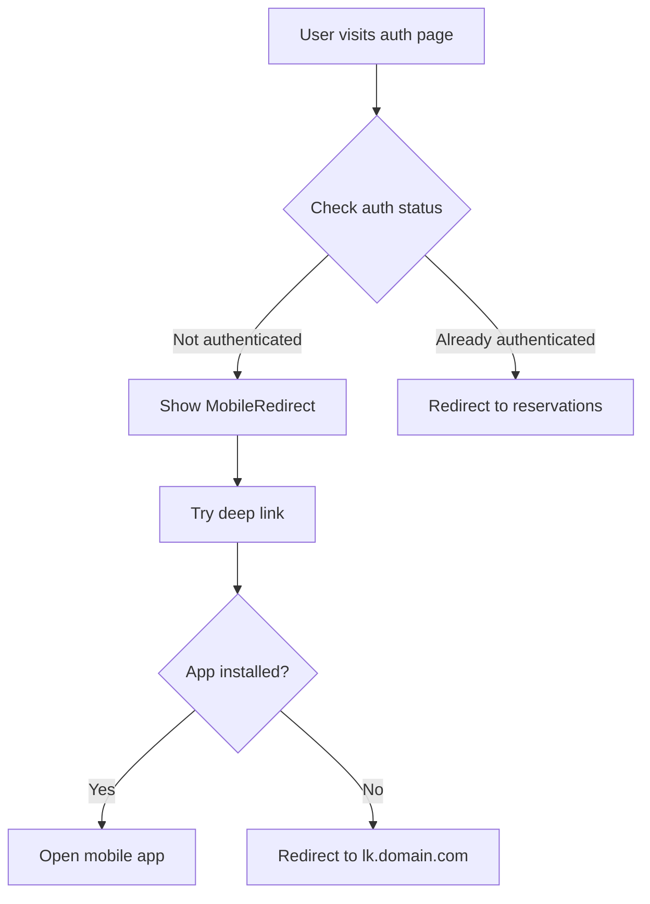
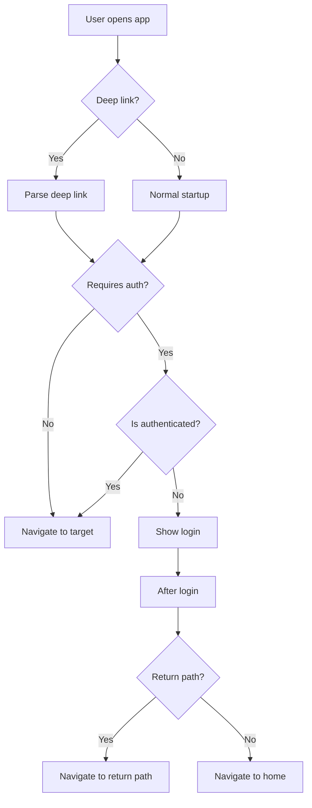

# Navigation and Routing Architecture

**Application**: Wish List Application
**Version**: 1.1.0
**Task**: T089 - Update navigation and routing to reflect separation of public/private functionality

## Overview

The Wish List Application implements a clear separation of concerns between public functionality (frontend) and private account management (mobile app). This document describes the navigation architecture, routing structure, and the distinction between public and private routes across platforms.

## Architecture Principles

### 1. Separation of Concerns

**Frontend (Next.js at domain.com)**:
- **Purpose**: Public wishlist viewing
- **Target Audience**: Anyone with a wishlist link (no account required)
- **Navigation Focus**: Browse and view content
- **Authentication**: Not required for primary features

**Mobile App (React Native at lk.domain.com)**:
- **Purpose**: Account management and wishlist creation
- **Target Audience**: Registered users
- **Navigation Focus**: Create, edit, and manage wishlists
- **Authentication**: Required for primary features

### 2. Navigation Strategy

**Frontend**: Minimal navigation, focused on content consumption
- Home page with app info
- Public wishlist viewing
- Guest reservation management
- Links to mobile app for account features

**Mobile**: Full navigation, focused on account management
- Tab-based navigation for primary features
- Stack navigation for detailed views
- Authentication-gated routes
- Deep linking from web

## Frontend Navigation (Next.js)

### Route Structure

```
frontend/src/app/
├── page.tsx                        # Home/Landing page (PUBLIC)
├── layout.tsx                      # Root layout
├── auth/
│   ├── login/page.tsx             # Redirects to mobile app
│   └── register/page.tsx          # Redirects to mobile app
├── public/
│   └── [slug]/page.tsx            # Public wishlist view (PUBLIC)
└── my/
    └── reservations/page.tsx      # Guest: view, Auth: redirect to app
```

### Route Classification

#### Public Routes (No Redirection)

| Route | Purpose | Authentication | Notes |
|-------|---------|----------------|-------|
| `/` | Landing page | None | Explains app, links to mobile |
| `/public/[slug]` | View public wishlist | None | Anyone can view and reserve gifts |

#### Guest Routes (Conditional Redirection)

| Route | Purpose | Authentication | Behavior |
|-------|---------|----------------|----------|
| `/my/reservations` | View reservations | Optional | Guests: view via localStorage token<br/>Authenticated: redirect to mobile app |

#### Account Routes (Always Redirect)

| Route | Purpose | Redirection |
|-------|---------|-------------|
| `/auth/login` | Login | → `wishlistapp://auth/login` |
| `/auth/register` | Registration | → `wishlistapp://auth/register` |

### Navigation Components

**MobileRedirect** (`frontend/src/components/common/MobileRedirect.tsx`):
- Universal component for redirecting to mobile app
- Attempts deep link to native app
- Falls back to mobile web (lk.domain.com)
- Used by all account-related pages

**useAuthRedirect** (`frontend/src/hooks/useAuthRedirect.ts`):
- Hook to check authentication status
- Returns `isAuthenticated` and `isLoading` states
- Used to conditionally redirect authenticated users

### User Flows

#### Flow 1: Guest Views Public Wishlist
```
User receives link
  → Opens domain.com/public/birthday-2026
  → Views wishlist (NO REDIRECT)
  → Can reserve gifts as guest
  → Reservations tracked via localStorage
```

#### Flow 2: Guest Views Reservations
```
Guest reserves a gift
  → localStorage token saved
  → Visits domain.com/my/reservations
  → Views guest reservations (NO REDIRECT)
  → No account needed
```

#### Flow 3: User Tries to Login from Web
```
User visits domain.com/auth/login
  → MobileRedirect activates automatically
  → Attempts: wishlistapp://auth/login
  → Fallback: https://lk.domain.com/auth/login
  → User logs in via mobile app/web
```

#### Flow 4: Authenticated User Accesses Account Features
```
Logged-in user visits domain.com/my/reservations
  → useAuthRedirect detects authentication
  → MobileRedirect activates
  → Deep link: wishlistapp://my/reservations
  → Opens mobile app to reservations tab
```

## Mobile Navigation (React Native)

### Route Structure

```
mobile/app/
├── _layout.tsx                     # Root layout with deep linking
├── providers.tsx                   # App providers (auth, theme, etc.)
├── linking.ts                      # Deep linking configuration
├── (tabs)/                         # Tab-based navigation (AUTH REQUIRED)
│   ├── _layout.tsx                # Tab bar configuration
│   ├── index.tsx                  # Home tab
│   ├── explore.tsx                # Explore public lists
│   ├── lists.tsx                  # User's wishlists
│   ├── reservations.tsx           # User's reservations
│   └── profile.tsx                # User profile
├── auth/                           # Authentication screens (NO AUTH)
│   ├── _layout.tsx                # Auth stack layout
│   ├── login.tsx                  # Login screen
│   └── register.tsx               # Registration screen
├── lists/                          # Wishlist management (AUTH REQUIRED)
│   ├── create.tsx                 # Create new wishlist
│   ├── [id]/
│   │   ├── index.tsx              # View wishlist details
│   │   └── edit.tsx               # Edit wishlist
├── gift-items/                     # Gift item management (AUTH REQUIRED)
│   └── [id]/
│       └── edit.tsx               # Edit gift item
├── public/                         # Public content (NO AUTH)
│   └── [slug].tsx                 # Public wishlist view
└── modal.tsx                       # Generic modal screen
```

### Route Classification

#### Tab Navigation (Authentication Required)

| Tab | Route | Purpose | Icon | Authentication |
|-----|-------|---------|------|----------------|
| Home | `/(tabs)/index` | Dashboard/home screen | house.fill | ✅ Required |
| Explore | `/(tabs)/explore` | Discover public lists | paperplane.fill | ✅ Required |
| Lists | `/(tabs)/lists` | User's wishlists | purchased | ✅ Required |
| Reservations | `/(tabs)/reservations` | User's reservations | bookmark.fill | ✅ Required |
| Profile | `/(tabs)/profile` | User profile & settings | person.fill | ✅ Required |

#### Authentication Routes (No Authentication Required)

| Route | Purpose | Can Access When |
|-------|---------|-----------------|
| `/auth/login` | User login | Not authenticated |
| `/auth/register` | User registration | Not authenticated |

#### Content Management Routes (Authentication Required)

| Route | Purpose | Parent Tab |
|-------|---------|-----------|
| `/lists/create` | Create wishlist | Lists |
| `/lists/[id]` | View wishlist | Lists |
| `/lists/[id]/edit` | Edit wishlist | Lists |
| `/gift-items/[id]/edit` | Edit gift item | Lists |

#### Public Content Routes (No Authentication Required)

| Route | Purpose | Access Level |
|-------|---------|--------------|
| `/public/[slug]` | View public wishlist | Anyone (same as frontend) |

### Navigation Guards

**Authentication Check**: Implemented in root `_layout.tsx`

```typescript
// Pseudo-code for auth guard
useEffect(() => {
  const checkAuth = async () => {
    const isAuthenticated = await authService.isAuthenticated();

    if (!isAuthenticated && requiresAuth(currentRoute)) {
      router.replace('/auth/login');
    }
  };

  checkAuth();
}, [currentRoute]);
```

**Protected Tabs**: All tabs require authentication
- If user not logged in → Redirect to `/auth/login`
- After successful login → Return to intended tab

**Public Routes**: Accessible without authentication
- `/auth/*` routes
- `/public/*` routes

### Deep Linking Integration

Deep links map to mobile routes:

| Deep Link | Mobile Route | Tab/Stack |
|-----------|--------------|-----------|
| `wishlistapp://home` | `/(tabs)/index` | Home tab |
| `wishlistapp://auth/login` | `/auth/login` | Auth stack |
| `wishlistapp://auth/register` | `/auth/register` | Auth stack |
| `wishlistapp://my/reservations` | `/(tabs)/reservations` | Reservations tab |
| `wishlistapp://lists` | `/(tabs)/lists` | Lists tab |
| `wishlistapp://lists/[id]` | `/lists/[id]` | Lists stack |
| `wishlistapp://explore` | `/(tabs)/explore` | Explore tab |
| `wishlistapp://profile` | `/(tabs)/profile` | Profile tab |

See `DEEP_LINKING.md` for complete deep linking documentation.

## Cross-Platform Consistency

### Shared Public Content

**Public Wishlist Viewing**:
- Frontend: `/public/[slug]` → Full-screen view
- Mobile: `/public/[slug]` → Same content, mobile-optimized

**Consistency**:
- Same API endpoints
- Same data models
- Same business logic
- Different UI optimized for platform

### Account Management

**Wishlists**:
- Frontend: Redirects to mobile app
- Mobile: Full CRUD operations in tabs

**Reservations**:
- Frontend: Guest reservations only (localStorage)
- Mobile: Full user reservations (authenticated)

**Profile**:
- Frontend: No profile management (redirects to mobile)
- Mobile: Complete profile management

## Navigation Patterns

### Frontend Patterns

**1. Progressive Enhancement**:
- Public content works without JS
- Deep links enhance with app opening
- Fallback to mobile web always available

**2. Minimal Navigation**:
- No complex nav structure
- Focus on content consumption
- Links to mobile app for actions

**3. Guest-Friendly**:
- No forced registration
- localStorage for guest data
- Seamless guest experience

### Mobile Patterns

**1. Tab-Based Primary Navigation**:
- 5 main tabs for core features
- Always visible and accessible
- Muscle memory for frequent users

**2. Stack-Based Secondary Navigation**:
- Drill down from tabs
- Back button to return
- Breadcrumb-style hierarchy

**3. Modal Overlays**:
- Non-blocking interactions
- Quick actions
- Dismissible without losing context

**4. Deep Link Aware**:
- Handles external navigation
- Preserves app state
- Graceful fallbacks

## Authentication Flow

### Frontend Authentication



### Mobile Authentication



## Error Handling

### Frontend

**Network Errors**:
- Show friendly error message
- Provide manual link to mobile web
- Allow retry

**Deep Link Failures**:
- Always show fallback link
- Timeout after 1.5s
- Clear messaging about what's happening

**Authentication Errors**:
- Guest features continue working
- Account features show redirect prompt
- No data loss for guest actions

### Mobile

**Navigation Errors**:
- Invalid routes → Home tab
- Missing params → Error screen with back button
- Network failures → Cached content when available

**Deep Link Errors**:
- Invalid format → Ignore and stay on current screen
- Unknown routes → Navigate to home
- Malformed params → Show error, navigate to safe screen

**Authentication Errors**:
- Session expired → Redirect to login with return path
- Network error → Show retry option
- API errors → User-friendly message

## Performance Considerations

### Frontend

**Code Splitting**:
- Each route is separate chunk
- Lazy load components
- Reduce initial bundle size

**Prefetching**:
- Prefetch mobile app redirect assets
- Preconnect to API endpoints
- Optimize font loading

### Mobile

**Tab Switching**:
- Lazy render inactive tabs
- Cache tab content
- Smooth transitions (no flicker)

**Deep Linking**:
- Fast parsing (<50ms)
- No blocking operations
- Optimistic navigation

**Stack Navigation**:
- Efficient screen mounting
- Memory-efficient stack
- Smooth animations

## Testing Strategy

### Frontend Navigation Tests

```typescript
describe('Frontend Navigation', () => {
  test('public routes are accessible', () => {
    // Test /public/[slug] loads without redirect
  });

  test('auth routes redirect to mobile app', () => {
    // Test /auth/login triggers MobileRedirect
  });

  test('guest reservations work without auth', () => {
    // Test /my/reservations for guests
  });

  test('authenticated users redirect to app', () => {
    // Test /my/reservations for authenticated users
  });
});
```

### Mobile Navigation Tests

```typescript
describe('Mobile Navigation', () => {
  test('tabs require authentication', () => {
    // Test unauthenticated user redirects to login
  });

  test('deep links navigate correctly', () => {
    // Test wishlistapp://lists opens lists tab
  });

  test('back navigation works', () => {
    // Test stack navigation back button
  });

  test('tab persistence', () => {
    // Test returning to app restores last tab
  });
});
```

## Accessibility

### Frontend

- **Keyboard Navigation**: Tab through links
- **Screen Readers**: ARIA labels on navigation
- **Focus Management**: Visible focus indicators
- **Skip Links**: Skip to main content

### Mobile

- **VoiceOver/TalkBack**: Tab labels announced
- **Gestures**: Swipe between tabs
- **Large Touch Targets**: Tabs are 44x44pt minimum
- **Reduced Motion**: Respect system preferences

## SEO Considerations (Frontend Only)

**Public Routes**:
- Server-rendered for SEO
- Proper meta tags (title, description)
- Structured data for gift lists
- Canonical URLs

**Account Routes**:
- `noindex` meta tag (redirect-only)
- Not included in sitemap
- Robots.txt allow crawling

## Migration Path

### Adding New Routes

**Frontend**:
1. Determine if public or account feature
2. If account → Use MobileRedirect component
3. If public → Create normal Next.js page
4. Update navigation docs

**Mobile**:
1. Create new screen file in appropriate directory
2. Add to tab or stack navigator
3. Update deep linking configuration
4. Add authentication guard if needed
5. Update navigation docs

### Removing Routes

1. Check for incoming deep links
2. Add redirect to new route
3. Update all internal navigation
4. Communicate to users
5. Monitor 404 errors

## Future Enhancements

### 1. Universal Links/App Links
Replace custom URL schemes with HTTPS-based deep linking for better reliability

### 2. Progressive Web App (Mobile Web)
Add PWA capabilities to mobile web (lk.domain.com) for app-like experience

### 3. Unified Navigation State
Share navigation state between frontend and mobile for seamless transitions

### 4. Smart Redirects
Detect device type and redirect to appropriate platform automatically

### 5. Navigation Analytics
Track user flows to optimize navigation structure

## Conclusion

The navigation architecture successfully separates public and private functionality across platforms while maintaining a cohesive user experience. The frontend focuses on content consumption with minimal navigation, while the mobile app provides full account management with tab-based navigation. Deep linking seamlessly connects the two platforms.

---

**Task**: T089 - Update navigation and routing
**Status**: ✅ Complete
**Implementation Date**: 2026-01-23
**Platforms**: Frontend (Next.js), Mobile (React Native/Expo)
